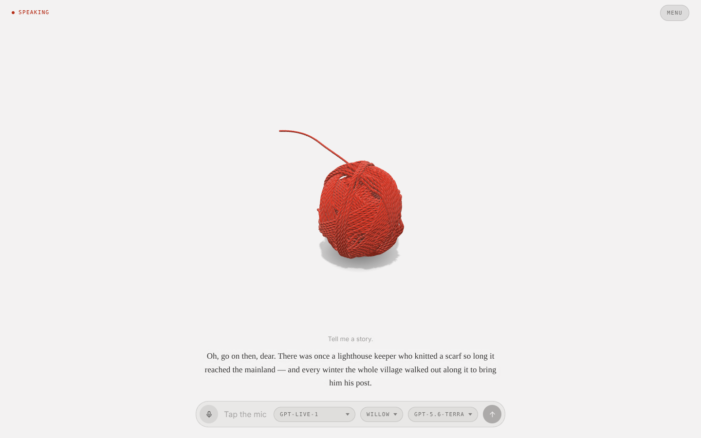
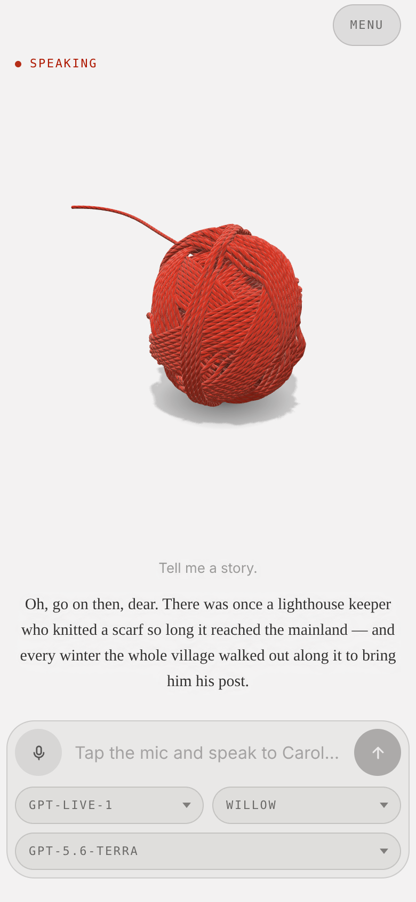

# Carol

A voice agent rendered as a ball of red wool on the floor, its strand laid out
behind it. When Carol talks she rolls toward you, paying out yarn as she goes;
when she listens she rocks a little way out, when she thinks she turns it over
in the middle of the room, and when it is all over she winds herself back in.

She talks like an old lady who has been knitting for seventy years: a retired
librarian, bookish and well read, never without a novel on the go or a
cardigan on the needles, who writes short stories and the odd poem — spinning a
yarn, in wool and in words. There is an old cat on her reading chair, though it
only comes up now and then. All of it is driven by a live OpenAI GPT-Live
conversation, in GPT-Live's feminine voices, with a Responses backend for
reasoning and web search. She remembers what you tell her to, between calls.

The life is a manner, not a feature: Carol has no camera and cannot see you,
her stories are made up and she says so, and when she doesn't know something
she has it looked up rather than making it up — see the
[AI Output Disclaimer](docs/ai-output-disclaimer.md).

The ball of yarn is the "Yarn" character asset, ported onto the small 3D engine
the other characters share. Carol is built from [Alan](https://github.com/h1ddenpr0cess20/alan)'s
code: the call, the HUD, the log, memory and tools are Alan's; the yarn, the
persona and the voices are hers.



<p align="center">
  
</p>

## Run

```sh
git clone https://github.com/h1ddenpr0cess20/carol
cd carol
npm install
cp .env.example .env      # add your OPENAI_API_KEY
npm run dev               # → http://localhost:5173
```

Requires API access to `gpt-live-1` and to the backend model (`gpt-5.6-terra`
by default). Voice duration, backend tokens and tool use are billed separately.

Click the mic, allow the browser's microphone prompt, and start talking.

Three pickers sit under the composer: the GPT-Live model that does the talking,
the voice she talks in — Willow, Delta, Gleam, Quartz or Bossa, Willow by
default — and the Responses model behind it that reasons, looks
things up and runs the tools. Changing any of them redials and keeps the
conversation.

Tapping the mic is the microphone switch: turning it off stops what you send and
leaves the answer playing, and the conversation is still there when you turn it
back on. It also switches itself off after a minute of silence, and the call
survives that too. Holding the mic down is the hang-up — a ring closes around it
while you hold, and the call ends when it lands.

Drag on the view to orbit round her, wheel to zoom in close enough to see the
plies, right-drag to pan. The camera stays above the floor.

`menu`, in the top corner, is where the panels live: `tools`, `memory` and the
log, one row each. Picking a row closes the menu behind it.

`tools` includes web search, on by default. Ask Carol about something current and
the backend can go and look while it keeps talking. What it read appears as
clickable links under the caption, and goes when the caption does. Switching
search off reconnects the call.

The log keeps every conversation. `continue` on one picks it back up: the call is
dialled again with those turns handed over as context, and what you say from
there lands in the same entry rather than a new one.

| Script | |
|---|---|
| `npm run dev` | Vite, with the proxy mounted as middleware — one process |
| `npm run dev:lan` | The same, over HTTPS on the network — for a phone |
| `npm run build` | Bundles the client to `dist/` |
| `npm start` | Serves `dist/` with the same proxy in front |
| `npm run preview` | `build` then `start` |
| `npm run preview:lan` | `build` then `start`, over HTTPS on the network |
| `npm test` | `node:test` over the client and server |
| `npm run lint` | ESLint |

CI runs the lint, the tests on Node 22.12 and 24, and a build that then has to
boot and serve itself over both HTTP and HTTPS. CodeQL scans the same source on
every push and again weekly, since its queries change faster than this does.

The yarn is drawn with WebGPU where the browser has it and WebGL 2 where it does
not, by the small engine in `src/client/vendor/gfx/`. `?renderer=webgl` pins the
fallback.

To run it on a phone, or in Docker, see
[configuration](docs/configuration.md#on-a-phone).

## Docs

- [**Configuration**](docs/configuration.md) — every environment variable, the
  voice picker, the HTTPS setup a phone needs for microphone access, and Docker.
- [**Design notes**](docs/design.md) — how the call is wired, what's in
  `localStorage`, how the ball is wound, how she rolls, the moods, the source
  layout, and the seam another provider would have to implement.
- [**AI Output Disclaimer**](docs/ai-output-disclaimer.md) — what the model says
  is the model's, not the author's, plus the risks that are specific to a live
  microphone and speech you hear before anyone can check it.
- [**Not a Companion**](docs/not-a-companion.md) — Carol is a toy and a demo.
  She is not a friend, a grandmother, a therapist or a partner, and the project
  will not grow in that direction.
